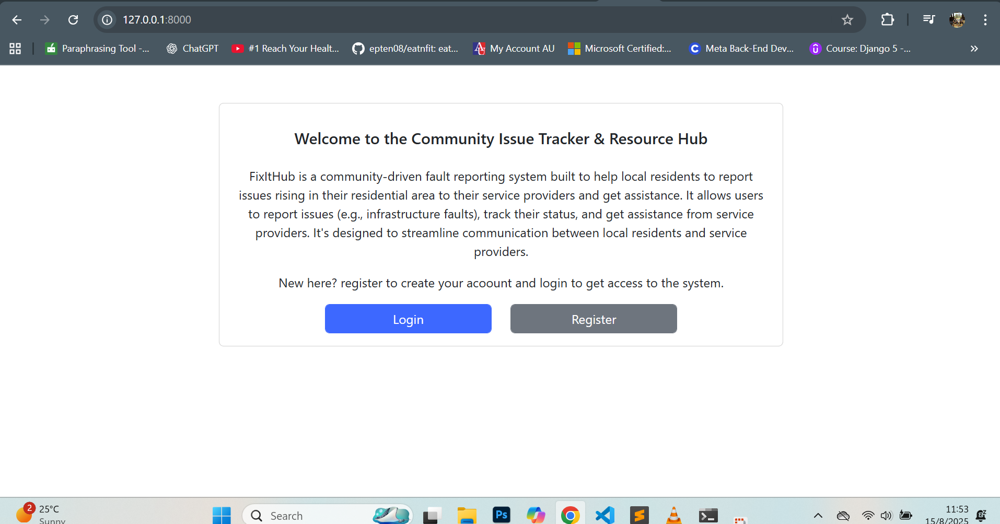
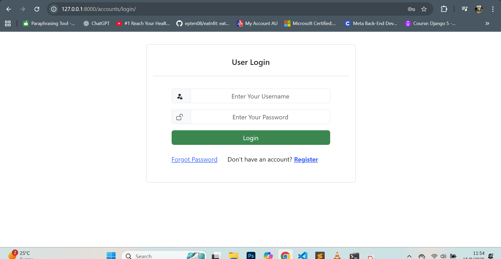
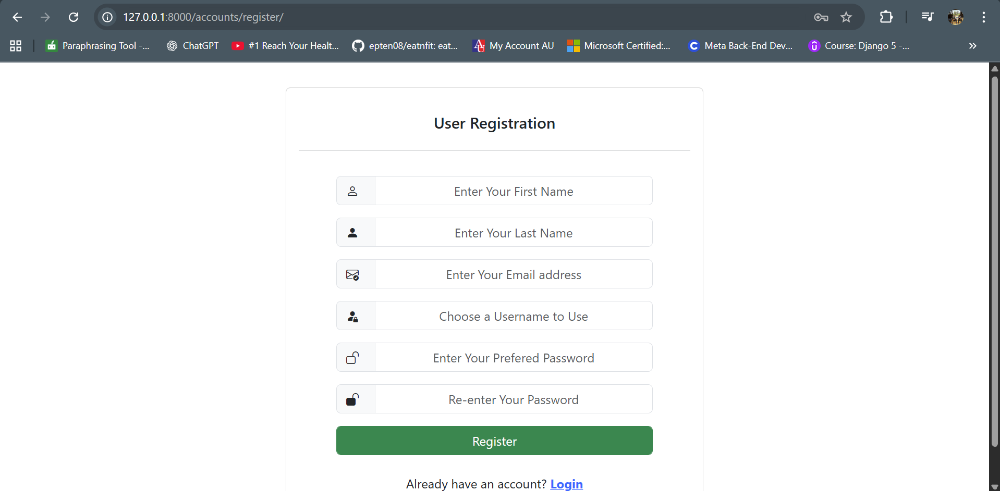
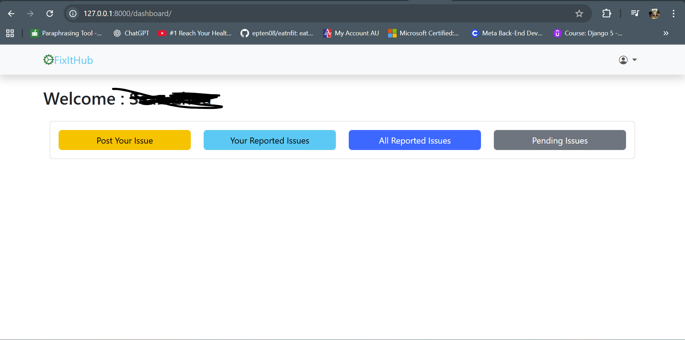
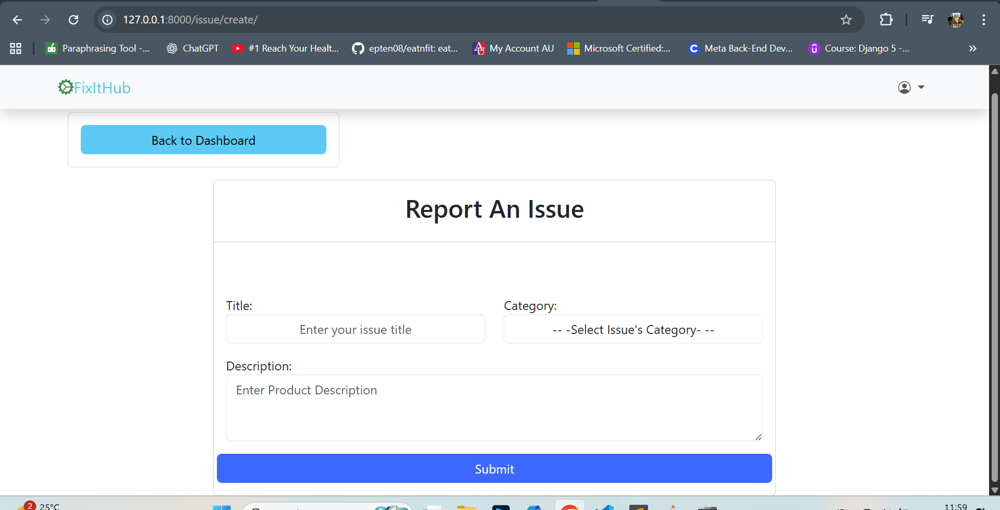
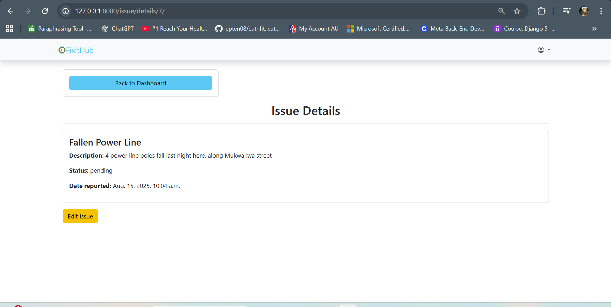
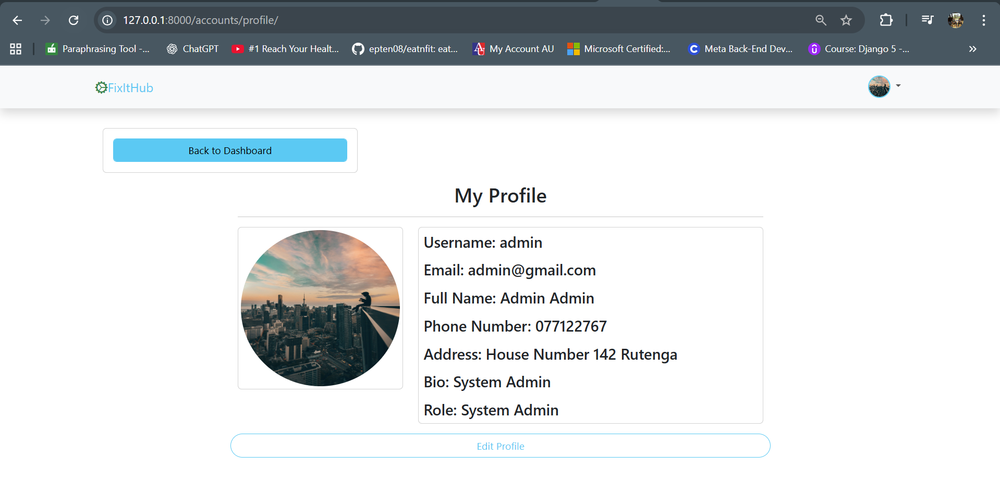

# 🛠️ FixItHub

**FixItHub** is a community-driven fault reporting system built with Django. It allows users to report issues (e.g., infrastructure faults), track their status, and communicate with system administrators. It's designed to streamline communication between users and system administrators.

---

## 🔧 Core Features Implemented

### 👥 User Management
- Custom user model with two user types:
  - `SystAdmin`: System administrator (registered via admin site/terminal only)
  - `SystUser`: Regular users who can register via the web
- Login, logout, registration
- UserProfile created automatically via Django signals
- Profile editing and viewing, including uploading a profile picture

### 📝 Issue Reporting
- SystUsers can:
  - Report new issues
  - View and edit **only their own issues**, if the status is still "Pending"
  - Delete their own issues
- SystAdmins can:
  - View all issues
  - Edit any issue (via a separate admin-specific edit view)
  - Delete issues
- Issues have a status (e.g., Pending, In Progress, Resolved)
- Detailed view page for each issue
- User-friendly error messages when editing and deleting is restricted

### 🖥️ Dashboards
- Separate dashboard views for:
  - SystAdmin (manage all issues)
  - SystUser (see and manage their own reports)

### 📸 Profile Management
- Profile view includes:
  - User bio, address, phone number
  - Uploaded profile picture (displayed and stored properly)
- Profile edit view with image upload support

---

## ⚙️ Technologies Used

- **Backend:** Django
- **Frontend:** Django Templates + Bootstrap
- **Database:** SQLite (default, can be changed to PostgreSQL/MySQL)
- **Authentication:** Django built-in auth with custom user model

---

## Installation & Setup

1. **Clone the repository**
  git clone https://github.com/tumbry10/FixItHub.git
  cd FixItHub

2. **Create a virtual environment**
  python -m venv venv
  source venv/bin/activate  # On Windows: venv\Scripts\activate

3. **Install dependencies**
  pip install -r requirements.txt

4. **Run migrations**
  python manage.py makemigrations
  python manage.py migrate

5. **Create a superuser**
  python manage.py createsuperuser

6. **Run the server**
  python manage.py runserver

7. **Access the app**
  Frontend: http://127.0.0.1:8000/
  Admin Panel: http://127.0.0.1:8000/admin/

## Screenshoots
1. [**Landing Page**]

2. [**Login Page**]

3. [**Registration Page**]

4. [**User Dashboard**]

5. [**Issue Reporting Page**]

6. [**Issues list Page**]

7. [**Issue Details Page**]

8. [**Profile Edit Page**]

9. [**Admin Dashboard**]